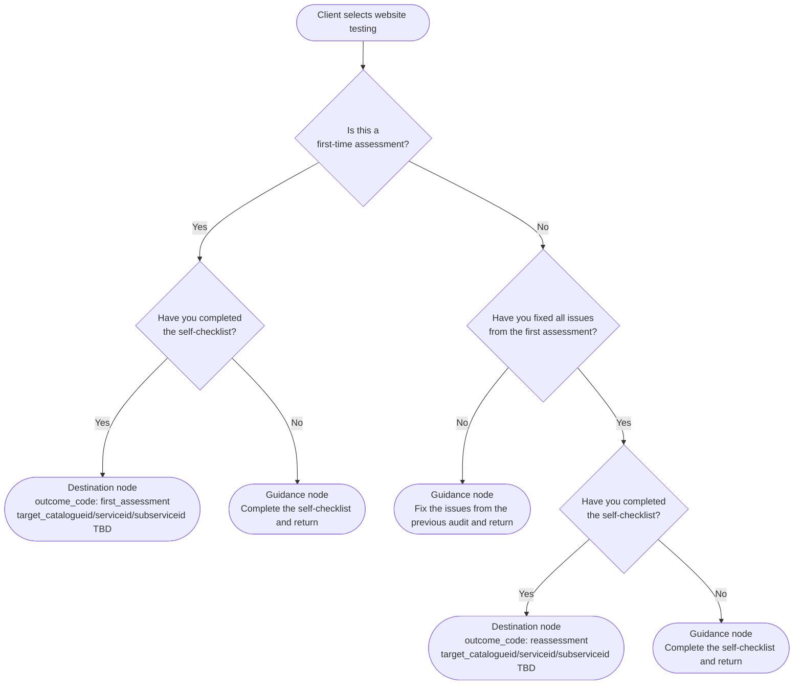

# Future Plan 009: Configurable Intake Flows

**Status:** Draft — Phase 1 under review
**Date Proposed:** 2026-07-17
**Branch context:** `request-catalogue`
**Estimated Effort:** Phased — see Implementation Phases below

---

## Overview

The `request-catalogue` branch introduced database-driven catalogue, service, and
subservice choices with guidance panels, checklist gates, bilingual content, and an
optional "Other" freeform field.  Those features handle the common case well.

Some intake paths require branching question sequences that cannot be expressed as a
single dropdown cascade.  This document proposes an **optional, administrator-configurable
question-flow system** that sits alongside the existing structure.  The existing behaviour
is preserved and used by default; custom flows are only attached where the standard
hierarchy is insufficient.

---

## Existing Work to Preserve

The following features must not be replaced or broken:

| Feature | Location |
|---|---|
| DB-driven service dropdown | `addrequest2-ajax1.php` |
| DB-driven subservice dropdown | `addrequest2-ajax2.php` |
| Guidance panels (Markdown) | `addrequest2-ajax1–3.php`, `guidance_text_en/fr` columns |
| Checklist gates | `needs_checklist`, `checklist_url_en/fr`, `checklist_name_en/fr` |
| Alert/resource panels | `alert_text_en/fr` columns |
| "Other" freeform option | `has_other_option` on `tblservices` |
| Bilingual content | all EN/FR column pairs |
| Existing request form | `openrequest2.php`, `openrequest3.php` |

Custom question flows are activated only when a catalogue, service, or subservice has a
non-null `intake_flow_id`.  All other items continue to use existing behaviour unchanged.

---

## Core Design Principle

Separate **request classification** from **client intake path**.

- **Classification** = the catalogue, service, and optional subservice identifiers used
  for routing, reporting, team assignment, and service delivery standards.
- **Intake path** = the questions, answers, guidance, resources, and form destinations
  that guide the client before the request is submitted.

Every completed intake path must resolve to real classification identifiers before opening
the existing request form.  The form itself does not change.

---

## Fresh-Install Strategy

Docker initializes a new database using `database/schema.sql` followed by
`database/reference.sql`.  The numbered migration files are **not** run automatically;
they are for upgrading existing databases.

| Install type | Path |
|---|---|
| Clean (new Docker volume) | `schema.sql` → `reference.sql` |
| Existing database upgrade | Apply numbered migrations in order |

`schema.sql` reflects the full post-migration structure and must be kept in sync with
the highest-numbered applied migration.  `reference.sql` contains the canonical seed data
and must produce the same final state as applying all migrations to an empty database.

---

## No-Services and No-Subservices Fallback

### Catalogue with no active services

When a catalogue has `is_guidance_only = 0`, no custom `intake_flow_id`, and no active
services in `tblservices`, `addrequest2-ajax1.php` now renders a **Continue** button.

The button submits the form with only the catalogue classification (`catalogueid`).
Neither `serviceid` nor `subserviceid` are sent in the POST.  `openrequest3.php`
normalises missing values to SQL `NULL` so that `tbltriage` stores `NULL` rather than a
fake zero.

This is distinct from the intentional "no match" path:

- **"no match" (serviceid = 0 from the dropdown):** The user deliberately selected
  "The choices listed do not match my request."  `addrequest2-ajax2.php` responds with a
  freeform `clientnotes` textarea.  `serviceid` reaches `openrequest3.php` as `0`, which
  is also stored as `NULL` in `tbltriage`.
- **No-services catalogue:** No service dropdown is ever shown.  `serviceid` and
  `subserviceid` are absent from POST.

Both paths store `NULL` in `tbltriage.serviceid` and `tbltriage.subserviceid`.

### Service with no active subservices

This is handled by the existing cascade:
- No subservices + `needs_checklist = 1` → checklist gate (ajax2)
- No subservices + no checklist → Continue button (ajax2)

---

## Resolution Order

When the client selects or arrives at a catalogue, service, or subservice item, apply
these rules in order:

1. If the item has a non-null `intake_flow_id` → start that published custom flow.
2. If `is_guidance_only = 1` → display the guidance panel and stop (no form).
3. If the item has active child items → display the choices (existing dropdown cascade).
4. If the item has `needs_checklist = 1` → display the checklist gate (existing).
5. Continue directly to the existing request form using the item's classification IDs.

A more-specific attachment (subservice > service > catalogue) overrides a less-specific
attachment.  Rule 1 takes priority.  An item must not have both `is_guidance_only = 1`
and a non-null `intake_flow_id`; the administrator interface must prevent this.

---

## Flow Versioning and Immutability

Published flows must be immutable so that editing a flow cannot change an intake already
in progress.

### How it works

1. A flow starts as a **draft** (`status = 0`).
2. After passing publication validation, it becomes **published** (`status = 1`).
3. To modify a published flow, the administrator **clones** it — creating a new draft
   with `version_number` incremented by one and `previous_version_id` pointing to the
   current published version.
4. The original published version is unchanged.  Any in-progress responses continue
   to use it via `tblintakeresponses.flow_version_id`.
5. When the clone passes validation, it is published and the previous version is
   **archived** (`status = 2`).

### Key fields

| Field | Purpose |
|---|---|
| `flow_family_key` | Stable slug shared by all versions (e.g. `website-testing`) |
| `version_number` | Monotonically increasing integer within a family |
| `previous_version_id` | FK to the version this was cloned from |
| `status` | `0`=draft, `1`=published, `2`=archived |
| `UNIQUE (flow_family_key, version_number)` | Prevents duplicate versions |

`tblcatalogue.intake_flow_id`, `tblservices.intake_flow_id`, and
`tblsubservices.intake_flow_id` always point to a **specific published version** record,
not to a family.  When a new version is published, these columns are updated to point to
the new version.

---

## Supported Node Types

### Question node

Fields:
- `prompt_en`, `prompt_fr` — the question text (required)
- `intro_en`, `intro_fr` — optional introductory paragraph (Markdown)
- `presentation` — `radio` or `select`
- Answer options (see `tblintakeoptions`) — at least two required for publication
- Resources (see `tblintakeresources`)
- Each answer option has a `next_node_id` pointing to the next node. `NULL` is
  permitted only while constructing an incomplete draft; every active option in a
  published flow must point to another node.

### Guidance node

- `heading_en`, `heading_fr` — required
- `body_en`, `body_fr` — Markdown body rendered server-side
- Resources (zero or more)
- **Terminal**: does not create a request; the client must return to a previous step or
  follow an external link to prepare

### Request-form destination node

- `target_catalogueid` — required; must be an active `tblcatalogue` record
- `target_serviceid` — optional; must be an active `tblservices` record in that catalogue
- `target_subserviceid` — optional; must be an active `tblsubservices` record for that
  service
- `outcome_code` — optional stable internal identifier (e.g. `first_assessment`)
- **Terminal**: opens the existing `openrequest2.php` form pre-populated with the target
  classification IDs

---

## Explicit Terminal Outcomes

`NULL` on `next_node_id` is permitted **only** while constructing an incomplete draft.
`NULL` never means "this branch ends here" and never triggers request submission.

Guidance and destination nodes are terminal because of their **node type**, not because
of any null pointer. Options do not appear on guidance or destination nodes; those
node types are leaves and cannot have answer options.

Every active answer option in a published question node must point to another node via
a non-null `next_node_id`.

Publication validation must reject:

1. Flows with no `start_node_id`.
2. Question nodes with fewer than two active answer options.
3. Any active answer option with `next_node_id = NULL`.
4. Any answer option whose `next_node_id` references a node in a different flow version.
5. Destination nodes referencing inactive or non-existent catalogue/service/subservice
   IDs.
6. Flows with any cycle (detected by graph traversal from `start_node_id`).
7. Any node not reachable from `start_node_id`.
8. Incomplete bilingual content — every EN field must have a non-empty FR equivalent.
9. Items that have both `is_guidance_only = 1` and a non-null `intake_flow_id`.

---

## Option-Level Free-Form Field

`allow_freeform` is on `tblintakeoptions`, not on `tblintakenodes`.

This means one specific answer choice (e.g. "Other — please describe") can reveal a
labelled text area while other choices on the same question do not.

Fields on `tblintakeoptions`:

| Column | Purpose |
|---|---|
| `allow_freeform` | `1` = selecting this option reveals a text field |
| `freeform_required` | `1` = text field is required when this option is selected |
| `freeform_label_en` | Accessible label for the field (English) |
| `freeform_label_fr` | Accessible label for the field (French) |

**Accessible behaviour**: The text area is rendered with a `<label for="…">` whose `for`
attribute matches the textarea `id`.  The `required` attribute is added to the textarea
only when the option is selected (enforced server-side; client-side is a progressive
enhancement).

---

## Bilingual Resource Links

`tblintakeresources` stores two URLs per resource:

| Column | Notes |
|---|---|
| `url_en` | English URL (required; `https://` or `mailto:` only) |
| `url_fr` | French URL (`https://` or `mailto:` only; falls back to `url_en` when `NULL`) |

The future admin interface must validate both URLs against `^(https://|mailto:)` before
saving.  The runtime renderer must pass the URL through `htmlspecialchars()` when writing
the `href` attribute.

---

## Bilingual Response Snapshots

`tblintakeresponses` stores one row per answered step per request:

| Column | Purpose |
|---|---|
| `flow_version_id` | Exact `tblintakeflows.id` version used (not the family key) |
| `lang` | Interface language at time of submission (`en` or `fr`) |
| `prompt_snapshot_en` | English prompt text at time of submission |
| `prompt_snapshot_fr` | French prompt text at time of submission |
| `answer_snapshot_en` | English answer label at time of submission |
| `answer_snapshot_fr` | French answer label at time of submission |
| `freeform_text` | User-entered free-form text (not translated) |

Snapshots are captured at submission time so that records remain readable after a flow
version is edited, cloned, or archived.

---

## Website Testing Example

This is the primary pilot use-case for Phase 4.  Exact catalogue, service, and subservice
identifiers are decisions requiring confirmation (see end of document).

### Text walkthrough

The client selects website testing.  The flow asks whether this is a first-time
assessment or a reassessment.

**First-time assessment path:**
1. "Is this a first-time assessment?" → Yes
2. "Have you completed the self-checklist?" → Yes → **destination: first-assessment**
3. "Have you completed the self-checklist?" → No → **guidance: complete the checklist and return**

**Reassessment path:**
1. "Is this a first-time assessment?" → No
2. "Have you fixed all issues from the first assessment?" → No → **guidance: fix the issues and return**
3. "Have you fixed all issues from the first assessment?" → Yes
4. "Have you completed the self-checklist?" → Yes → **destination: reassessment**
5. "Have you completed the self-checklist?" → No → **guidance: complete the checklist and return**

### Mermaid flowchart

Each node maps to a database row.  Destination nodes carry real classification IDs.

This is stored entirely as data in `tblintakeflows`, `tblintakenodes`,
`tblintakeoptions`, and `tblintakeresources`.  There is no hard-coded PHP branching.

---

## JavaScript and Progressive Enhancement

> **Current status (Phase 1):** The standard catalogue / service / subservice cascade
> (addrequest2-ajax1–4.php) continues to depend on JavaScript.  The initial catalogue
> dropdown populates the service div via AJAX; without JavaScript nothing is loaded and
> the client cannot proceed.
>
> The form has a hint that "the form will display the next step after you select an
> option," which is not accurate without JavaScript.
>
> **This is not yet fixed.**  JavaScript-independent navigation is a Phase 2 requirement.

The **configurable intake flows** introduced in Phase 2+ will use server-rendered PHP:
standard `<form method="post">` submissions, visible Continue and Back buttons, and
session-backed step state.  No drag-and-drop or client-side scripting will be required.

The existing AJAX cascade is not required to be fully accessible without JavaScript before
Phase 2.  The design document does not claim otherwise.

---

## Security Requirements for Future Admin Mutations

All admin mutations to flow data must:

1. **Authorise** before acting: verify `$_SESSION['is_admin'] || $_SESSION['is_superuser']`.
2. **CSRF protect** form submissions with a synchronised token (validated server-side).
3. **Use prepared statements** for all reads and writes.
4. **Escape output** with `htmlspecialchars()` for any user-controlled or DB-sourced text
   rendered into HTML.
5. **Validate resource URLs** against `^(https://|mailto:)` (case-insensitive) before
   saving and before rendering.  Reject bare `http://` URLs.
6. **Log actions** to `tbladminlog` using the existing logging pattern: publish, archive,
   and flow-attachment changes all write a row.

---

## Administrator Interface (Phase 3)

### Catalogue / service / subservice editing

Add an **"Intake behaviour"** section to `edit-catalogue.php`, `edit-service.php`,
and `edit-subservice.php`.  It contains a radio group:

- **Use standard behaviour** (default) — existing dropdown cascade, guidance, or
  checklist
- **Use a custom intake flow** — reveals a selector listing published flows

When "Use a custom intake flow" is selected, `is_guidance_only` is forced off and hidden
(prevents conflict per resolution rule ordering).

### Flow management page

A new admin page listing all flows with: Name (EN/FR), Status, Node count, Last updated,
Actions (Edit, Preview, Archive).

**Flow editor** — an accessible ordered list of steps.  Each step shows its type as a
text label (not colour alone) and provides Edit, Delete, Move up, Move down controls.

- Move up/Move down buttons include hidden text naming the step being moved.
- All actions have descriptive accessible names.

**Publication flow**: Validate → Preview → Publish.  Validation shows a linked error
summary.  Preview renders the flow server-side in the current language.

---

## Implementation Phases

### Phase 1 — Database foundation and no-services fallback ✅

- Migration 016: five intake tables with non-destructive, guarded DDL (versioning,
  bilingual resources, bilingual response snapshots, option-level free-form).
  Legacy rows on upgraded databases receive deterministic family keys (`legacy-flow-<id>`).
  The deprecated node-level `allow_freeform` column is left in place on upgraded databases;
  it is absent on clean installs and will be removed by a future cleanup migration.
- `schema.sql` and `reference.sql` updated for clean-install parity.
- `addrequest2-ajax1.php`: no-services catalogue shows a Continue button (no fake IDs).
- `openrequest3.php`: `serviceid` and `subserviceid` of 0 or absent stored as SQL `NULL`.
- `requires_ssc_check` removed from all application queries and new-install schema.
- Migration 014 updated: `requires_ssc_check` removed from ADD COLUMN. Workshops
  catalogue is inserted as guidance-only (current tracked branch state; final hierarchy
  pending product confirmation — see Decisions Requiring Confirmation).

### Phase 2 — Read-only flow resolver and renderer

- Session-backed step controller for custom flows.
- `intake_flow_id` detection wired into `addrequest2-ajax1.php`.
- Server-rendered steps with Continue and Back buttons.
- No JavaScript required for custom flows.
- `tblintakeresponses` rows written after request creation in `openrequest3.php`.
- No admin editing yet; pilot data inserted manually.

### Phase 3 — Administrator editing, validation, preview, and publishing

- "Intake behaviour" section in edit-catalogue, edit-service, edit-subservice.
- Flow management page with step list editor.
- Publication validation (all 9 rules above).
- Text-based flow preview.

### Phase 4 — Website-testing pilot

- Create the website-testing flow via the admin UI.
- Attach to the appropriate classification records (identifiers TBD).
- End-to-end test of all Yes/No paths.

### Phase 5 — Gradual adoption

- Attach flows to other services as needed.
- Existing `needs_checklist` gates remain; only multi-question branches need custom flows.

---

## Verification Steps

| Step | Command / Action |
|---|---|
| PHP syntax — changed files | `docker compose exec web php -l /var/www/html/openrequest.php` and `addrequest2-ajax1.php`, `openrequest3.php` |
| Migration 016 on post-015 DB | `docker compose exec -T db mysql -u root -p"$DB_PASS" aaact < database/migrations/016-intake-flows.sql` — verify guarded ALTER TABLE succeeds and all rows are preserved |
| Migration 016 re-run (idempotent) | Run the migration a second time — all guards skip; no rows are changed or deleted |
| **Original-schema upgrade test** | **Pending Shawn’s approval** — requires an isolated disposable container to simulate upgrade from the Phase 1 original schema (before versioning columns). |
| **Clean-install test** | **Pending Shawn’s approval** — requires a separate disposable container. Exact commands provided on approval. |
| Clean schema install | Start fresh Docker volume; run `schema.sql` then `reference.sql`; verify `tblcatalogue` has `show_in_openrequest`, `intake_flow_id`; `tblintakeflows` exists with `flow_family_key` |
| Catalogue 3/6/8/13 in dropdown | Fresh install; open `/openrequest.php` — confirm those four catalogues appear |
| Catalogue with no services | Add a test catalogue with no services; select it — confirm Continue button appears, no `serviceid`/`subserviceid` in POST |
| NULL storage | Submit a no-services catalogue request; confirm `tbltriage.serviceid IS NULL` and `tbltriage.subserviceid IS NULL` |
| Service with subservices | Select a service with subservices — confirm dropdown appears (unchanged) |
| Service with no subservices | Select service with no subservices — confirm Continue button (no checklist) |
| Service "no match" / Other | Select "The choices listed do not match…" — confirm freeform textarea; NULL stored in DB |
| Checklist gate preserved | Select a service/subservice with `needs_checklist = 1` — gate appears; `checklist_yes` proceeds; `checklist_no` shows warning |
| English resource rendering | (Phase 2+) Guidance node renders `url_en` in `href` |
| French resource rendering | (Phase 2+) Guidance node renders `url_fr` when set, falls back to `url_en` |
| Bilingual response snapshot | (Phase 2+) After submission, `tblintakeresponses` has both `prompt_snapshot_en` and `prompt_snapshot_fr` |
| Draft vs published flow | (Phase 3+) Draft flow is not shown on intake page; only published flows are |
| Branch destinations required | (Phase 3+) Publishing a flow with an active option whose `next_node_id` is NULL or invalid is rejected |
| Cycle detection | (Phase 3+) Circular graph is rejected at publication |
| JavaScript disabled | (Phase 2+) Custom flows complete using `<form method="post">` only; current AJAX cascade does **not** work without JS (known limitation until Phase 2) |

---

## Concerns

1. **`requires_ssc_check` dormant column.** Added by the original migration 014.
   Databases that applied it retain the column as an unused `TINYINT(1) DEFAULT 0`.
   It is not present in `schema.sql` (clean installs) and is not queried by any PHP.
   A future cleanup migration may `DROP COLUMN` it.
2. **`guidance_url_en/fr` columns.** Added in migration 014 for `tblcatalogue` and
   `tblservices`.  Not used by any PHP or admin forms.  Reserved for future use or
   can be dropped in a cleanup migration.
3. **AJAX-dependent cascade.** The existing catalogue/service/subservice cascade requires
   JavaScript.  The inline page hint implies dynamic behaviour.  This is deferred to
   Phase 2 to implement server-side fallback.
4. **No CSRF protection on existing admin POSTs.** The new flow management page (Phase 3)
   must implement token validation.  Existing forms should be audited separately.

---

## Decisions Requiring Confirmation

| Decision | Question |
|---|---|
| Website-testing catalogue ID | Which `tblcatalogue.id` should the flow attach to? |
| First-assessment destination | Which `tblservices.id` and `tblsubservices.id` represent a first-time website audit? |
| Reassessment destination | Which IDs represent a reassessment? |
| Self-checklist URL | What is the URL for the self-checklist resource in guidance nodes? |
| Checklist gate migration | Should existing `needs_checklist` gates on current subservices be replaced by flow nodes in Phase 4, or remain? |
| Flow attachment level | Should the website-testing flow attach at catalogue or service level? |
| Back-navigation scope | Should Back navigation allow returning past the standard cascade into the catalogue dropdown? |
| Response retention | How long should `tblintakeresponses` rows be kept? Are they in scope for any data-purge process? |
| **Workshops final hierarchy** | Tracked branch state: guidance-only. Live dev database contains manually-inserted services 119–122 and subservices 213–218 from earlier sessions that are not tracked in any migration or reference file. What is the approved final hierarchy for the Workshops catalogue? |
