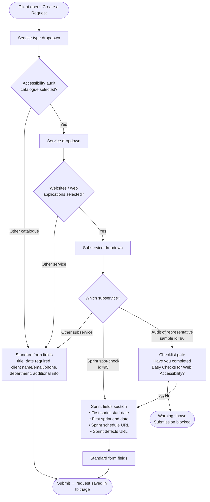

# Sprint Spot-Check Fields Feature

**Status:** Dormant — disabled as of 2026-07-16. The database column and PHP code remain intact and can be re-activated without code changes.

---

## What This Feature Does

When a client submits an accessibility request for a **website sprint spot-check or audit**, the standard new-request form can be extended with four additional fields that the audit team needs to schedule and perform the review:

| Field | Purpose |
|---|---|
| First Sprint Start Date | When the sprint under review begins |
| First Sprint End Date | When the sprint under review ends |
| Sprint Schedule URL | Link to the sprint backlog or calendar (e.g., Jira board) |
| Sprint Defects URL | Link to the defect tracker or bug list for the sprint |

These fields only appear when the client has navigated to a subservice that has `needs_sprint_fields = 1` in the `tblsubservices` table. All other request types skip them entirely.

---

## How the Flow Works

### Text description

A client opens the Create a Request page and selects a service type. If they choose **Accessibility audit**, they are shown a service dropdown. If they then choose **Websites / web applications** from that dropdown, they see a subservice dropdown. Two subservices can trigger the sprint fields:

1. **Sprint spot-check** (subservice id 95) — goes directly to the sprint fields section, then to the standard form fields.
2. **Audit of representative sample** (subservice id 96) — first shows a checklist gate ("Have you completed the Easy Checks for Web Accessibility?"). If the client answers No, they are shown a warning and submission is blocked. If they answer Yes, they proceed to the sprint fields section and then to the standard form fields.

All other service and subservice selections bypass the sprint fields entirely and go straight to the standard form fields.

### Visual flowchart



---

## Technical Reference

### Database

- **Column:** `tblsubservices.needs_sprint_fields` (TINYINT, default 0)
- **Active subservices when enabled:** id 95 (Sprint spot-check), id 96 (Audit of representative sample), both under service 28 (Websites / web applications), catalogue 8 (Accessibility audit)
- **tbltriage columns that store the values:** `firstsprintstartdate`, `lastsprintstartdate`, `sprintschedule`, `sprintdefects`

### PHP files

- `app/openrequest2.php` — reads `needs_sprint_fields` via a DB query on the selected subservice and conditionally renders the four sprint fields before the standard fields
- `app/includes/edit-subservice.php` — *previously* exposed a "Show sprint date fields in request form" checkbox in the admin UI; removed 2026-07-16 to reduce admin complexity while keeping the feature dormant

### Activation / deactivation

To **re-enable** the sprint fields for a subservice, run:

```sql
UPDATE tblsubservices SET needs_sprint_fields = 1 WHERE id IN (95, 96);
```

To **disable** again:

```sql
UPDATE tblsubservices SET needs_sprint_fields = 0 WHERE id IN (95, 96);
```

If you want to expose the flag in the admin UI again, re-add the following block to `app/includes/edit-subservice.php` immediately before the Save/Cancel buttons:

```php
<div class="form-group">
    <div class="checkbox">
        <label>
            <input type="checkbox" name="needs_sprint_fields" value="1"
                   <?= !empty($row2['needs_sprint_fields']) ? ' checked' : '' ?>>
            <?= $is_french
                ? 'Afficher les champs de dates de sprint dans le formulaire'
                : 'Show sprint date fields in request form' ?>
        </label>
    </div>
</div>
```

And restore the matching lines in the POST handler and SQL UPDATE string (see git history, commit `8dd7288`).
